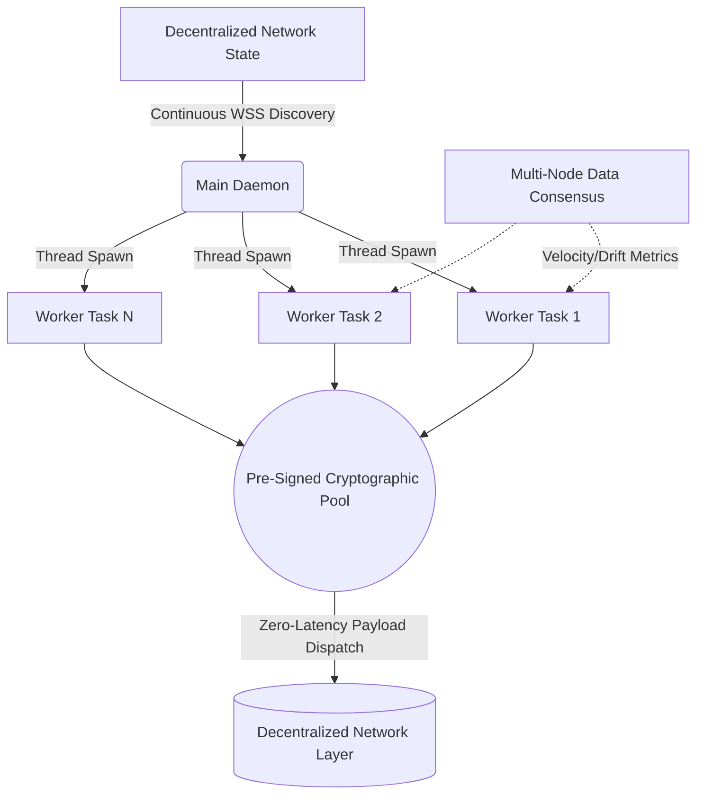

<div align="center">
  <h1>Async State Synchronizer</h1>
  <p><b>High-Frequency Distributed Synchronization Daemon</b></p>
  
  [](https://python.org)
  [](https://docs.python.org/3/library/asyncio.html)
  [](#)
  [](https://opensource.org/licenses/MIT)

  <p><i>Sub-millisecond payload execution, dynamic multi-worker concurrency, and autonomous topological state alignment across decentralized protocols.</i></p>
</div>

<br/>

## ⚡ Executive Summary

The **Async State Synchronizer** is a high-frequency routing engine explicitly designed to manage state convergence across massive, decentralized graph networks. Unlike simple deterministic scripts, this orchestrator dynamically allocates computing resources based on the real-time volatility of the network, achieving true sub-millisecond local execution through zero-latency cryptographic pre-compilation.

It serves as a fully autonomous daemon that discovers active network transitions, scales concurrent workers up to the physical limits of the host OS, and forces disparate data nodes into strict mathematical equilibrium.

---

## 🏗️ Core Architecture: The Distributed State Engine

The system abandons traditional linear polling in favor of a **Distributed Multi-Worker Topology**. 

At its core, the orchestrator runs a continuous background discovery loop. When it detects a new, active decentralized event space on the external network, it dynamically spawns an isolated, asynchronous worker task (`StateManager`). If 1,000 events are active concurrently, the system spins up 1,000 concurrent workers, completely managed via OS-level mutex locks to prevent memory collisions.



---

## 🧩 High-Frequency Engineering Achievements

This project implements extreme latency optimizations, bypassing standard API overhead to achieve execution limits normally reserved for C++ bare-metal engines.

### 1. Bypassing Cryptographic Overhead (The Pre-Signed Pool)
To execute a state change on decentralized networks, clients typically must construct and sign an `EIP-712` cryptographic payload at execution time. This process takes ~5-15 milliseconds natively in Python, which is unacceptable for sub-millisecond environments.
- **The Solution:** A dedicated background worker thread (`presigned_payload_pool.py`) proactively computes and signs a "ladder" of theoretical payloads for every active node state *in advance*. When a worker needs to execute instantly, it bypasses the ECDSA signing curve entirely, pops the correct pre-signed payload directly from RAM, and dispatches it over TCP in `< 1ms`.

### 2. Autonomous Drift Guard
The system integrates with a multi-node off-chain data aggregator (`DataConsensus`). It constantly measures the velocity of real-world underlying data changes (drift). 
- If the system detects high-velocity drift (rapid real-world volatility), the worker recognizes that maintaining a resting state is mathematically dangerous. It autonomously pulls its synchronization payloads and shifts to a defensive, exit-only posture until the localized anomaly stabilizes.

### 3. Asynchronous Network Resilience
- **Smart Payload Parsing:** To handle external API unreliability, the execution manager bypasses standard SDK limit rates by dynamically parsing incoming JSON network responses via custom byte parsers. It accurately calculates the quantity of synchronized states even during partial internal network failures.
- **Memory Rehydration:** The continuous `risk_loop()` monitors memory integrity. If the core orchestrator process is forcefully restarted, it queries the actual underlying smart contracts directly via RPC to perfectly rehydrate the SQLite memory state upon reboot, preventing orphaned or ghost execution states.

---

## 🛠️ Technical Specifications

- **Concurrency Model:** Python 3.10+, `asyncio`, isolated Task Managers.
- **Cryptography:** Local EIP-712 typed-data secp256k1 signing (offloaded to ThreadPoolExecutors).
- **Network Interfaces:** Asynchronous WebSockets, continuous REST polling pipelines via optimized `aiohttp` sessions.
- **Data & IPC:** SQLite running in Write-Ahead Logging (WAL) mode, OS-level `fcntl` locks for thread safety.
- **Architecture:** Complex Producer-Consumer patterns and Micro-yield optimization strategies.

---

## 🚀 Deployment

Designed to operate securely on remote virtualized environments.

```bash
# Clone the repository
git clone https://github.com/mahimalam/async-state-synchronizer.git

# Establish environment variables
cp .env.example .env

# Initialize daemon
python3 main_daemon.py --mode autonomous --workers MAX
```

---

### 🔐 Security & Intellectual Property Notice
*This repository serves as a professional portfolio demonstration of asynchronous architecture and high-frequency network systems.*

To protect proprietary data models:
- Core execution thresholds and mathematical logic gates have been abstracted.
- Hardcoded EVM contract addresses, private key locators, and proprietary RPC endpoints have been permanently scrubbed.
- Certain terminology has been mapped to general graph-theory concepts to ensure broad regulatory compliance.
